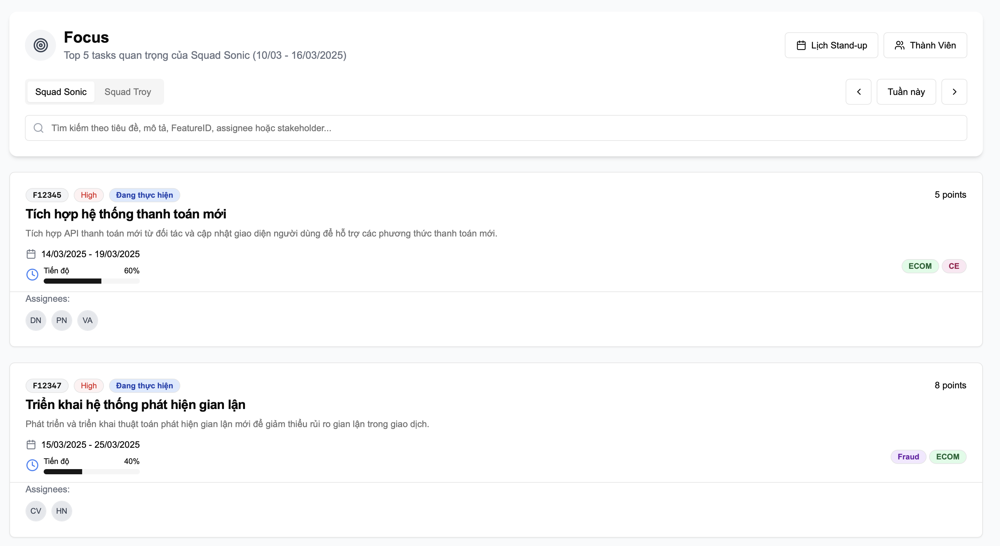

# Engineer Manager Toolkit

A modern web application built to help engineering managers streamline their daily tasks, track team performance, and manage resources effectively.

## 📸 Showcase

Here's a visual tour of the Engineer Manager Toolkit's key features and interfaces:

### Team & Member Management
<div style="display: flex; gap: 20px; margin-bottom: 30px;">
  
  
</div>

### Schedule & Calendar
<div style="display: flex; gap: 20px; margin-bottom: 30px;">
  
  
</div>

### Task & Focus Management
<div style="display: flex; gap: 20px; margin-bottom: 30px;">
  
  
</div>

### Stakeholder Management
<div style="display: flex; justify-content: flex-start; margin-bottom: 30px;">
  
</div>

## 🚀 Features

- [ ] Frontend
  - [ ] Team Management Dashboard
    - [x] Loading Team List, each member should:
      - [x] Full Name
      - [x] Phone Contact
      - [x] Email
      - [x] PID
      - [x] Squad
    - [ ] Adding new Team member 
    - [ ] Remove a current Team member
  - [ ] Task (Schedule, and Effort) Tracking
    - [ ] SIT Support
    - [ ] Incident Support
    - [ ] Problem Management
    - [ ] Change Request and Management
    - [ ] Roster Planning (Primary / Secondary)
  - [ ] Managing Follow Up Item in a Task
    - [ ] Sub Task List
    - [ ] Dependency Items
    - [ ] Block Items
    - [ ] Note
  - [ ] Team Calendar & Rotation Management
    - [x] Daily schedule display
    - [x] Weekly / Monthly schedule
    - [ ] Rotation Swap (Week Swap, Day Swap)
  - [ ] Report in graphic / dashboard
    - [ ] How many sprint a member doing a host
    - [ ] How many sprint a member doing roster
    - [ ] How many points a member complete per sprint

- [ ] Backend service
  - [ ] API Development
    - [x] Team Management APIs
      - [x] CRUD operations for team members
      - [x] Team composition management
      - [x] Role assignments
    - [x] Task Management APIs
      - [x] Task creation and updates
      - [x] Status tracking
      - [ ] Effort logging (acutal / estimate efforts)
    - [x] Calendar APIs
      - [x] Schedule management
      - [x] Rotation handling
      - [x] Availability tracking
  - [ ] Authentication & Authorization
    - [ ] User authentication
    - [ ] Role-based access control
    - [ ] Session management
  - [ ] Data Processing
    - [ ] Report generation
    - [ ] Analytics calculations
    - [ ] Performance metrics
  - [ ] Integration Services
    - [ ] Email notifications
    - [ ] Calendar sync
    - [ ] External tools integration

- [x] Database
  - [x] Schema Design
    - [x] Team Members
      - [x] Personal information
      - [x] Contact details
      - [x] Role and permissions
      - [x] Team assignments
    - [x] Tasks
      - [x] Task details and metadata
      - [x] Status tracking
      - [x] Effort logging
      - [x] Dependencies
    - [x] Calendar Events
      - [x] Schedule entries
      - [x] Rotation records
      - [x] Availability status
    - [x] Reports
      - [x] Performance metrics
      - [x] Sprint statistics
      - [x] Team analytics
  - [x] Performance Optimization
    - [x] Query Optimization
    - [x] Indexing Strategy
    - [x] Caching Implementation

## 🛠 Tech Stack

### Frontend
- **Framework:** [Next.js 15.1.0](https://nextjs.org/) with App Router
- **Language:** [TypeScript](https://www.typescriptlang.org/)
- **Styling:** 
  - [Tailwind CSS](https://tailwindcss.com/)
  - [Shadcn UI](https://ui.shadcn.com/)
- **Components:** 
  - [Radix UI](https://www.radix-ui.com/) for accessible components
  - [Framer Motion](https://www.framer.com/motion/) for animations
- **State Management:** React Server Components + Server Actions

### Backend
- **Runtime:** [Node.js](https://nodejs.org/)
- **Framework:** [NestJS](https://nestjs.com/)
- **Database:** 
  - [PostgreSQL](https://www.postgresql.org/) for primary data
  - [Redis](https://redis.io/) for caching
- **ORM:** [Prisma](https://www.prisma.io/)
- **Authentication:** [NextAuth.js](https://next-auth.js.org/)
- **API Documentation:** [Swagger](https://swagger.io/)

### DevOps
- **Package Manager:** [pnpm](https://pnpm.io/)
- **Containerization:** [Docker](https://www.docker.com/)
- **CI/CD:** GitHub Actions
- **Monitoring:** [Sentry](https://sentry.io/)

## 📦 Project Structure

```
engineer-manager-toolkit/
├── client/                 # Frontend application
│   ├── src/
│   │   ├── app/           # Next.js App Router pages
│   │   │   ├── ui/       # Shadcn UI components
│   │   │   └── features/ # Feature-specific components
│   │   ├── lib/          # Utility functions
│   │   ├── hooks/        # Custom React hooks
│   │   ├── services/     # API services
│   │   ├── types/        # TypeScript types
│   │   ├── constants/    # Constants
│   │   └── styles/       # Global styles
│   ├── public/           # Static assets
│   └── Configuration files
│
├── server/                # Backend application
│   ├── src/
│   │   ├── modules/      # Feature modules
│   │   │   ├── squads/  # Squad management
│   │   │   ├── tasks/   # Task management
│   │   │   ├── auth/    # Authentication
│   │   │   └── users/   # User management
│   │   ├── shared/      # Shared resources
│   │   │   ├── config/  # Configuration
│   │   │   ├── constants/ # Constants
│   │   │   ├── errors/  # Error handling
│   │   │   ├── middlewares/ # Middlewares
│   │   │   ├── types/   # Shared types
│   │   │   └── utils/   # Utility functions
│   │   ├── app.ts       # Main application
│   │   └── server.ts    # Server entry point
│   ├── prisma/          # Database
│   │   ├── schema.prisma # Database schema
│   │   └── migrations/  # Database migrations
│   └── Configuration files
│
├── docs/                 # Project documentation
└── README.md
```

## 🚀 Getting Started

1. Clone the repository:
```bash
git clone https://github.com/aletuan/engineer-manager-toolkit.git
cd engineer-manager-toolkit
```

2. Install dependencies:
```bash
pnpm install
```

3. Set up environment variables:
```bash
# Copy example env files
cp client/.env.example client/.env
cp server/.env.example server/.env
```

4. Set up the database:
```bash
# Generate Prisma client
pnpm db:generate

# Run migrations
pnpm db:migrate
```

5. Start the development server:
```bash
pnpm dev
```

6. Open [http://localhost:3000](http://localhost:3000) in your browser.

## 📝 Available Scripts

### Development
- `pnpm dev` - Start development servers for both client and backend
- `pnpm build` - Build both client and backend
- `pnpm start` - Start production servers
- `pnpm lint` - Run linting for both client and backend
- `pnpm type-check` - Run TypeScript type checking

### Database
- `pnpm db:generate` - Generate Prisma client
- `pnpm db:migrate` - Run database migrations
- `pnpm db:studio` - Open Prisma Studio for database management

### Testing
- `pnpm test` - Run tests for both client and backend
- `pnpm test:watch` - Run tests in watch mode
- `pnpm test:coverage` - Generate test coverage reports

### Code Quality
- `pnpm format` - Format code using Prettier
- `pnpm clean` - Clean build artifacts and dependencies
- `pnpm prepare` - Set up Git hooks

## 🔧 Development Guidelines

### Code Style
- Use TypeScript for all code
- Follow ESLint and Prettier configurations
- Write meaningful commit messages
- Keep components small and focused

### Git Workflow
- Create feature branches from main
- Use conventional commits
- Run tests before committing
- Keep commits atomic and focused

### Testing
- Write unit tests for utilities
- Write integration tests for API endpoints
- Write E2E tests for critical user flows
- Maintain good test coverage

## 🤝 Contributing

1. Fork the repository
2. Create your feature branch (`git checkout -b feature/amazing-feature`)
3. Commit your changes (`git commit -m 'feat: add amazing feature'`)
4. Push to the branch (`git push origin feature/amazing-feature`)
5. Open a Pull Request

## 📝 License

This project is licensed under the MIT License - see the [LICENSE](LICENSE) file for details.

## 🙏 Acknowledgments

- [Shadcn UI](https://ui.shadcn.com/) for the beautiful component library
- [Next.js](https://nextjs.org/) team for the amazing framework
- All contributors who help improve this toolkit

---

Built with ❤️ for Engineering Managers 

### Role Assignments
- [x] Role Management
  - [x] Create role with permissions
  - [x] Update role details
  - [x] Delete role
  - [x] List all roles
  - [x] Get role by ID
- [x] Role Assignment
  - [x] Assign role to squad member
  - [x] Remove role from member
  - [x] List member's roles
  - [x] Role assignment history
- [x] Role Validation
  - [x] Role name validation
  - [x] Permission validation
  - [x] Role assignment validation
- [x] Role API Documentation
  - [x] Swagger UI integration
  - [x] API endpoint documentation
  - [x] Request/response schemas
  - [x] Example requests 